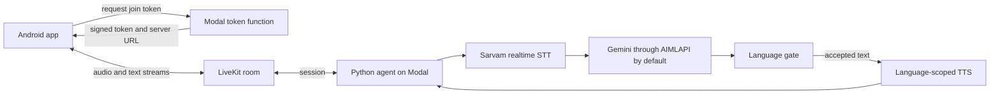

# Miithii developer guide

Reviewed against the local working tree on **7 October 2026**, based on commit `0a107fe`.
There are substantial uncommitted changes in this checkout. This document describes those files,
not a verified deployed revision or the current contents of GitHub's default branch.

This guide is a map of the implementation, not a promise that its behavior is complete. When
source and prose disagree, inspect the source and update the guide. Repository constraints in
`AGENTS.md` remain authoritative; dated phone observations belong in `current-work.md` and
`miithii-mobile-ui.md`.

## What runs

The client is Expo SDK 57 / React Native 0.86.3 with the official LiveKit React Native integration.
The backend is LiveKit Agents 1.8.3 running on Modal. LiveKit transports audio and text; Modal
hosts the Python worker and a separate token function.



The LLM request goes from the agent to its provider. The retired `api.miithii.in` Worker is not
in this voice pipeline. The model's function tools in `tools.py` are inert: they do not perform
network calls or mutate shared state. Do not infer an external action from a conversational reply.

## How a session starts and ends

1. The app opens disconnected. Pressing Start starts the native audio session and requests a
   LiveKit session with the chosen `miithii.language` participant attribute and agent name.
2. `token.py` validates the language and supported voice tier, generates a fresh room name,
   and signs a two-hour join token. It constrains named-agent dispatch and fixes the room's
   client participant limit to one. A client-supplied room name does not select the room.
3. The worker routes from that server-generated room name before the client joins. The language
   selects the pack, STT locale, prompt, output gate, and voice for that session.
4. Stop ends the session. Retry remounts a fresh client runtime and starts again. Selecting a
   different language remounts disconnected with a fresh room boundary and clears the displayed
   conversation. Opening the app does not start the microphone automatically.
5. Inactive/background app states stop the voice session. Client cleanup aborts pending starts
   and releases its native audio-session lease. The server retires turns on session close,
   failed startup, and worker cancellation.

Finished turns are retained in React state outside the remounted session subtree. This is
in-memory display history, not durable storage or a promise that a new agent session remembers
the earlier conversation. Language selection and the clear action clear that record.

**Admission is unfinished.** The token function has no identity authentication. Routing
restrictions do not establish who is requesting access or control public provider spending.
An authenticated admission design is required before public production use.

There is also a permission mismatch to review: `token.py` calls its grants audio-only, but the
current `AUDIO_ONLY_GRANT` has no `can_publish_sources` restriction. The app requests microphone
only and disables camera/screen share; that client behavior is not equivalent to restricting a
modified client's token permissions. Do not rely on the comments as proof of source enforcement.

## One spoken turn

Sarvam realtime receives `as-IN` for Assamese or `brx-IN` for Bodo, with explicit `codemix` mode
and `fast` stream type. Sarvam endpointing determines the end of a user turn. Silero VAD handles
interruptions separately. The pinned Sarvam integration has no model/keyterms constructor
controls; adding environment variables for those would not configure it.

The default LLM is Gemini 2.5 Flash through AIMLAPI, with reasoning disabled in the example
configuration. Direct Google is an explicit alternate route. Settings and deployment secrets
can change the effective route; defaults alone do not identify the deployed model.

`MiithiiAgent.llm_node` reads generation incrementally. It removes mood metadata, waits for
complete sentences, and checks each sentence before publishing its canonical text or passing
it to TTS. The gate checks control artifacts, script/Latin limits, configured blocked patterns,
sentence completeness, and request/turn budgets.

Before the first accepted sentence, a rejected answer can receive one model repair attempt,
then a reviewed native fallback if available. The first accepted sentence is the commit point:
audio may already be playing. A bad or incomplete later tail is withheld rather than rewriting
the heard prefix. The preview END carries `shortened` for that case. A reply can therefore be
partially delivered even though generation ended unsuccessfully.

Missing mood metadata uses neutral delivery; an invalid control header is removed. The supported
classification is internal metadata, not words to speak. No provider tags, bracketed delivery
cues, or dynamic mood-to-style projection are active.

These checks are not a semantic language or safety judge. Correct script does not prove correct
grammar, meaning, dialect, appropriate tone, or the absence of cross-language contamination.
The implementation needs native evaluation as well as deterministic tests.

## Synthesis and interruptions

| Language | Default speech | Explicit alternate |
| --- | --- | --- |
| Assamese (`asm`) | Bodhan, pack-selected voice | Server-configured ElevenLabs v4 family |
| Bodo (`brx`) | Bodhan, pack-selected voice | None in this implementation |

Bodhan is non-streaming per request. `StreamAdapter` uses Miithii's sentence tokenizer so accepted
sentences can enter synthesis while the model continues generating. The adapter buffers and
validates the entire WAV for each request before emitting audio. That is sentence-level pipelining,
not streaming audio from Bodhan. `wav.py` validates RIFF/WAVE bodies; the adapter treats them as
WAV despite the provider's observed `audio/mpeg` header.

The Assamese ElevenLabs route uses the official plugin pinned to a Git commit because its v4
support is newer than the 1.8.3 PyPI release. It requests original synchronized alignment and
uses Miithii's tokenizer. It requires explicit credentials and an Assamese voice ID. Bodo cannot
enter that branch. Voice suitability still requires listening and native review.

Interruption settings are explicit in `main.py`: VAD mode, 0.8-second minimum duration, two
recognized words, a 3-second false-interruption timeout, and false-interruption resume enabled.
Preemptive TTS is disabled. These values are implementation choices, not demonstrated optima.

An interruption clears LiveKit's queued output audio and truncates the transcript. Unplayed
sentences can be lost. Reducing false interruption and avoiding excessive buffering both matter;
a faster turn boundary can still make the conversation worse if it cuts off speech.

## Generated text is not delivered speech

There are two independent text paths:

- `miithii.reply` carries accepted generated text plus START/DELTA/END/REPAIR/VERDICT events.
  Its language, room, session, epoch, turn, revision, and sequence fields correlate the preview.
- LiveKit's `lk.transcription` supplies the TTS-aligned transcript used to advance speech state.
  It must not be replaced with the preview just because the preview is complete.

`turnTranscript.ts` collects transcript segments belonging to the current preview timestamp
boundary. If that boundary is missing, it falls back to the latest agent segment rather than
joining the room's entire historical transcript. That degraded path provides less correlation.

`alignment.ts` measures the matching prefix of preview and transcript, ignoring whitespace.
It does not trust the transcript's length. A mismatch stops advancement; interruption leaves
remaining generated sentences unspoken. On the Bodhan route, aligned sentence text is the text
handed to synthesis, so divergence is a bug to investigate rather than a spelling tolerance.

**The evidence has a limit.** `test_tts_alignment.py` drives the real adapter with a stubbed HTTP
boundary and reads timed text from emitted audio frames. It establishes sentence ordering and
text agreement. It does not establish that a phone speaker played those frames. It also records
that LiveKit can fall back to generated text when no audio/alignment is produced. The app consumes
agent transcripts without independent physical playback evidence, so transcript equality alone
cannot rule out a false speech claim on that failure path. End-to-end provider-failure acceptance
remains necessary.

`TurnRegistry` rejects retired or cancelled turns on the server. Client preview readers invalidate
their async loops on disconnect and signal/media reconnect. These mechanisms depend on real
lifecycle wiring, not merely on having an epoch field in a payload.

## Language data and review

`packages/language-packs` owns the registry and language-specific policies. `compile.mjs` validates
packs and produces `compiled/language-packs.json` with a content hash. Python hash-verifies and
loads that artifact; the TypeScript reader imports it for the mobile registry and segmentation
fixtures. Freshness checks ensure the artifact matches its inputs.

Canonical IDs are `asm` and `brx`. Provider mappings such as Bodhan `as` and Sarvam `as-IN` come
from the packs and are not application language identities. Each session loads one policy;
Assamese and Bodo rules, prompts, voices, fallback lines, and review content must stay isolated.

Both packs remain draft. Their migrated English linguistic instructions have provenance and
owner approval for migration; that does not approve every native production entry. Exemplars,
fallback lines, crisis triggers, and spoken crisis resources require native reviewer metadata.
The compiler refuses unapproved entries and refuses `shipped` packs missing required reviewed
resources. Empty draft resources are deliberate and can mean that no fallback speech is available.

Do not fill these gaps with LLM-written Assamese or Bodo. Review grammar, contamination, crisis
behavior, fallback speech, names, and provider pronunciation separately. Hash integrity establishes
consistent bytes, not the linguistic quality of those bytes.

## Code map

Paths below are relative to the repository root.

| File or directory | Read it for |
| --- | --- |
| `apps/mobile/App.tsx` | Token source, session operations, language changes, background teardown |
| `apps/mobile/src/hooks/useReplyPreview.ts` | LiveKit text-stream subscription and reconnect invalidation |
| `apps/mobile/src/lib/replyPreview.ts` | Preview parsing, correlation, ordering, replacement |
| `apps/mobile/src/lib/turnTranscript.ts` and `alignment.ts` | Current-turn transcript and permitted speech highlights |
| `apps/mobile/src/lib/conversation.ts` | Display history and live-turn assembly |
| `apps/mobile/src/lib/audioSessionLease.ts` and `cancelledConnection.ts` | Native audio ownership and late connection cleanup |
| `services/agent/miithii_agent/main.py` | Session construction, streaming gate, repair, lifecycle wiring |
| `services/agent/miithii_agent/enforcement.py` and `policy.py` | Output checks, prompts, compiled pack loading |
| `services/agent/miithii_agent/voice_tts.py`, `tts_bodhan.py`, `wav.py` | Provider routing, synthesis, audio validation |
| `services/agent/miithii_agent/token.py` and `rooms.py` | Join-token boundary and immutable session route |
| `services/agent/miithii_agent/turns.py`, `preview.py`, `timing.py` | Stale-work guards, text protocol, server measurements |
| `services/agent/modal_app.py` | Container image, worker subprocess, secrets, token endpoint |
| `packages/language-packs/scripts/compile.mjs` | Schema, native approval requirements, compilation and freshness |

## Run it locally

Use Python 3.12, uv, and pnpm 11.19.0 as declared by the project. Use a Node runtime supporting
the mobile test command's `--experimental-strip-types` flag. Android development also needs a
working Android SDK/JDK and a phone or emulator. LiveKit's native WebRTC integration requires
a native development build; Expo Go is not the runtime for this app.

From the repository root:

```powershell
pnpm install --frozen-lockfile
uv sync --directory services/agent
pnpm run check
```

After an approved language-data edit, regenerate before checking:

```powershell
pnpm run compile:language-packs
pnpm run check
```

Copy `services/agent/.env.example` to the gitignored `.env` and configure the credentials for
your chosen routes. The worker needs LiveKit connection/signing settings, Sarvam, the selected
LLM, and speech-provider settings. Read `config.py` for actual validation. Start a development
worker with its environment file explicitly supplied:

```powershell
$agentEnvPath = (Resolve-Path services/agent/.env).Path
uv run --env-file $agentEnvPath --directory services/agent python -m miithii_agent.main dev
```

The installed worker CLI still supports `dev` but marks it deprecated in favor of `lk agent dev`.
Here uv loads the environment file; `dev` itself has no `--env-file` option. A local worker still
needs a reachable token issuer; the development command does not start Modal's token function.

In `apps/mobile/app.json`, configure `extra.livekitTokenEndpoint` and `extra.livekitAgentName`
for your environment. The checked-in endpoint points to the project owner's deployment; replace
it for an independent setup. A nonempty development token server ID takes precedence over the
endpoint in `App.tsx`. The phone's agent name must match the worker/token allowlist.

```powershell
pnpm android
```

That invokes `expo run:android`. Later, `pnpm --dir apps/mobile start` starts Metro for the installed
development client. These are setup commands inferred from the current entrypoints and scripts;
this documentation task did not perform a clean-machine install, native build, or live session.

## Deploy and test with evidence

`modal_app.py` defines the `miithii-livekit-agent` app. It currently limits the worker to one warm
CPU container and one warm idle job process. It is an alpha workload configuration, not a measured
capacity plan. The token function scales independently. Create your own Modal secrets matching
`miithii-livekit-agent-secrets`, `miithii-elevenlabs-assamese`, and `miithii-llm-route`, then follow
the agent README. The image copies the compiled artifact and pins the ElevenLabs plugin commit.

```powershell
modal deploy services/agent/modal_app.py
```

Deployment and voice probes use external services and may incur charges. Neither is part of
the root check. Never put signing secrets or provider keys in app configuration, Git, or screenshots.

`pnpm run check` must exit 0. Its offline suites cover pack approval/freshness, gating and repair,
provider adapters, turn retirement, preview correlation, alignment, and mobile state reducers.
They do not prove live service availability or audio quality. Provider probes in the agent README
test real services; phone listening tests cover the last leg.

When measuring latency, name the boundary and instrument. `TurnTimings` reports committed-turn,
generation, canonical-sentence, synthesis, and agent playout stages. It does not measure physical
speech-end to first audible phone output. Record those phone boundaries separately.

## Known gaps to carry forward

- Public admission lacks user authentication, and token publishing-source restrictions need review.
- Both language packs lack complete native production review and required reviewed speech resources.
- Zero-audio transcript fallback needs end-to-end failure testing before trusting speech highlights.
- Start/cancel, reset, live language switch, background/reconnect, and audible interruption still
  need the remaining phone acceptance listed in `current-work.md`.
- Latency tuning needs comparable spoken turns per language, including false interruption and
  actual phone audibility; no server duration alone establishes the user's waiting time.
- Scrollback, conversation scaling, and sensory/haptic behavior have remaining device checks.
- The current status note identifies uncaught asynchronous haptic rejection handling as follow-up
  work. No phone failure is recorded for it; it is not established as a user-visible incident.

For a change, update the relevant focused test and run the root check. If it affects speech,
record the provider/phone evidence and what remains unheard. Update this guide when the session
flow or setup changes; keep incident details and build observations in the indexed evidence files.

